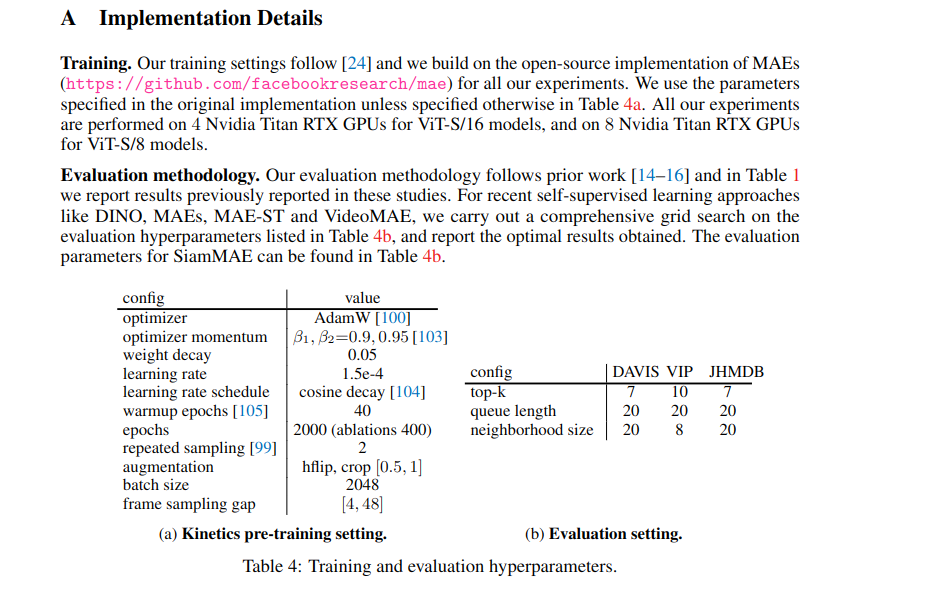
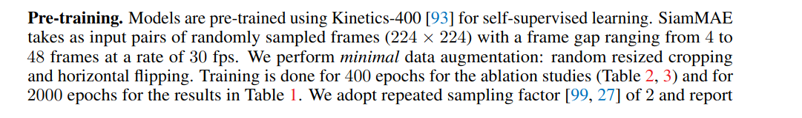
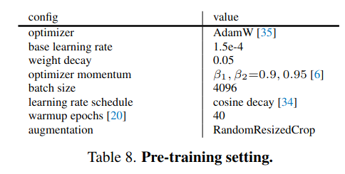
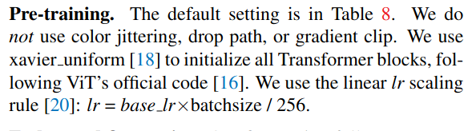
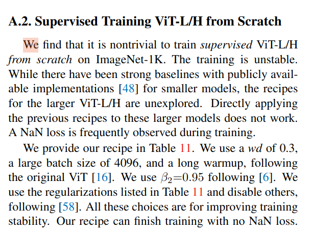
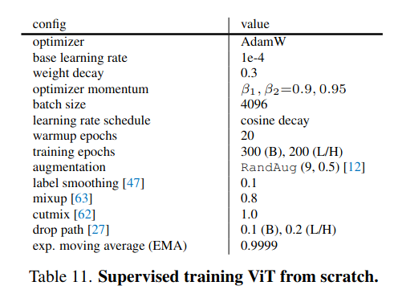

# Casper's notes

## Pretraining

#### Information from siamMAE paper




**Summarized:** Training settings follow the code from facebookresearch/mae (Masked
autoencoders are scalable vision learners) unless stated otherwise in table 4a.

To get all the hyperparams and information we must look at the code from facebookresearch/mae and the paper from facebookresearch/siam-mae.

#### Information from MAE paper


#### In MAE paper: training from scratch unstable




### PreTraining siamMAE parameters

- **optimizer :** AdamW
- **optimizer momentum :** $\beta_1=0.9,\beta_2=0.95$
- **weight decay :** 5e-2
- **learning rate :** 1.5e-4
- **learning rate scheduler :** cosine decay
- **warmup epochs :** 40
- **epochs :** 2000 (400 ablation study)
- **repeted sampling :** 2
- **augmentation :** hflip, crop[0.5,1]
- **batch size :** 2048
- **frame sampling gap :** [4,48]
- **resolution :** 224x224


### PreTraining siamMAE code analysis

**Link to reference code given in siamMAE:** [MAE code from facebook](https://github.com/facebookresearch/mae/blob/main/engine_pretrain.py)


**Scheduler:**
```
def adjust_learning_rate(optimizer, epoch, args):
    """Decay the learning rate with half-cycle cosine after warmup"""
    if epoch < args.warmup_epochs:
        lr = args.lr * epoch / args.warmup_epochs 
    else:
        lr = args.min_lr + (args.lr - args.min_lr) * 0.5 * \
            (1. + math.cos(math.pi * (epoch - args.warmup_epochs) / (args.epochs - args.warmup_epochs)))
    for param_group in optimizer.param_groups:
        if "lr_scale" in param_group:
            param_group["lr"] = lr * param_group["lr_scale"]
        else:
            param_group["lr"] = lr
    return lr
```


**Zero grad before training: (needed?)**
```
    optimizer.zero_grad()
```

**Do not understand this part:**
```
    param_groups = optim_factory.add_weight_decay(model_without_ddp, args.weight_decay)
    optimizer = torch.optim.AdamW(param_groups, lr=args.lr, betas=(0.9, 0.95)) # Why add weight decay here?
    print(optimizer)
    loss_scaler = NativeScaler() # Why do we need a loss scaler here? 

```


### PreTraining siamMAE recipie


Psuedo code:
```
import os
import time
from tqdm import tqdm

import matplotlib.pyplot as plt
import jax
import jax.numpy as jnp
from jax import jit, grad, lax, random
from jax.example_libraries import stax, optimizers
from torch.utils import data
# from functools import partial
import omegaconf
from jax.config import config
# IMPORTANT NOTE:
# if you have got a NaN loss and/or have trouble debugging. Then, set
# jax_disable_jit to True. This will help you print out the variables.
import flax
import flax.core

config.update('jax_disable_jit', False)


# Get the parameters as a omegaconf 
hparams = omegaconf.OmegaConf.load("hparams.yaml")

# Get the dataset 
from dataset import PreTrainingDataset # pytorch dataset
from dataset import PreTrainingTransform # pytorch transforms
dataset = PreTrainingDataset(transform=PreTrainingTransform())

# Load dataset into dataloader
from dataset import PreTrainingDataLoader
dataloader = PreTrainingDataLoader()

# Initialize model 
from model import SiamMAE
model = SiamMAE() # Contains: forward
forward = model.forward

# Initialize loss function, operates on the entire batch at once
def siamMAELoss():
    pass

# Initalize a scheduler
def scheduler():
    pass

# Initialize a loss scaler (Skip for now)
def lossScaler():
    pass

# Initialize a logger (Skip for now)
def logger():
    pass

# Initialize a epoch trainer, iter over all batches in the dataset, reset all gradients and optimizer at the start of each epoch 
def epoch_step():
    pass


# Initialize a eval function (can be merged with loss function later)
def eval():
    pass

# Initialize a trainer, iter over all epochs, save model at the end of each epoch

# initialize optimizer
# opt_state = opt_init(params)
opt_init, opt_update, get_params = optimizers.adam(step_size=0.0001)  # this time we use a smaller learning rate due to numerical stability
opt_state = opt_init(params)


# Now we can start training
```


## Good Libraries

* **dm_pix** - [DeepMind Pixel Consistency](https://www.google.com/url?sa=t&rct=j&q=&esrc=s&source=web&cd=&ved=2ahUKEwiB6aCp1ryCAxUpGBAIHSfXAc0QFnoECBMQAQ&url=https%3A%2F%2Fgithub.com%2Fdeepmind%2Fdm_pix&usg=AOvVaw1-5yfD7eQjubJM3WtVWqVn&opi=89978449)