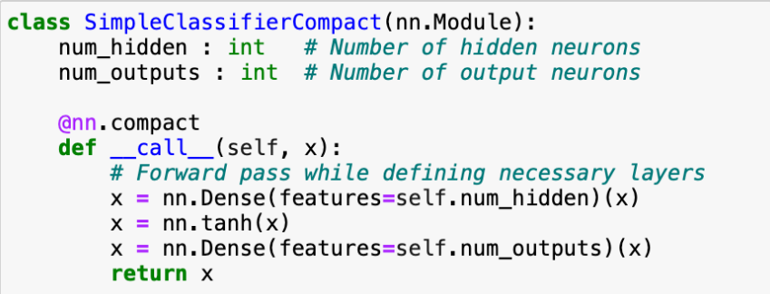

# Casper's notes

## Siamese Masked Autoencoders

Extension of masked autoencoders to learn visual correspondence from video frames. 

### Architecture

### Questions

Terminology and concepts:

   - visual correspondence: matching features Done 
   - masked autoencoders: masking Done
   - contrastive learning: feture extraction. encoder penalize negative examples and reward positive examples. Apple, apple masked/agumented, orange. Done
   - triplet loss: used in contrastive learning to penalize negative examples and reward positive examples. Done
   - Siamese networks: an example of a contrastive learning network. Done
   - cross-attention layers Done
   - How transformers work Done
   - affinity matrix Done
   - vison transformers Done
   - temporal correspondence: matching features across time, finding logic and patterns over time. Done
   - predictive learning Done
   - position embedding (transformers) Done
   - \[CLS] token Done
   - temporal position embeddings Done
   - temporal correspondence Done
   - temporal correlations Done
   - siamese encoder Done
   - A joint encoder Done
   - A joint decoder Done
   - A cross-self decoder Done
   - A cross decoder Done

