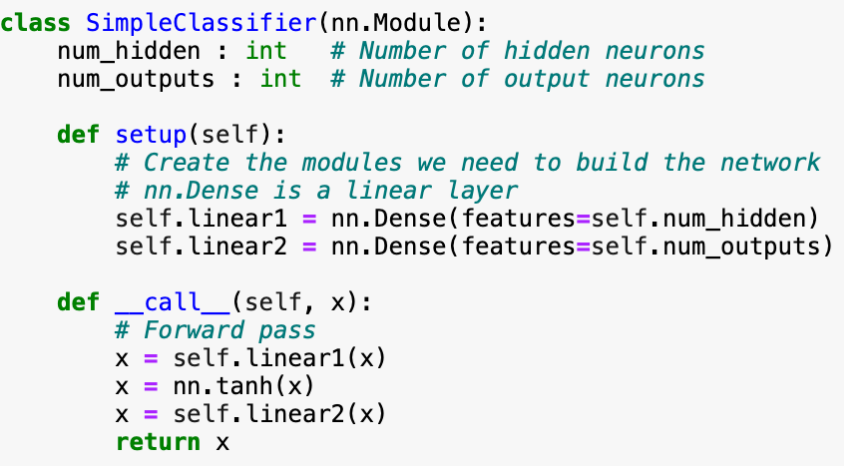
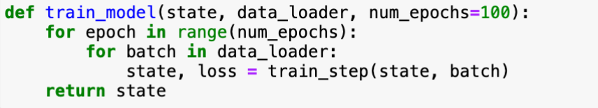

# How to build an JAX optimizer

## Step one **Model**
Create a FLAX nn module


When initliazing the module, the ``class SimpleClassifier`` global variables are going to be initialized. We define it as an object
```
model = SimpleClassifier(num_hidden=10, num_classes=10)
```

You also need to initailize the ``__call__`` function. You do it by calling the ``init`` function of the ``nn.Module`` class. You should pass a random key and arugment of the same shape as the the call function will be called with. We will get the model params, they will be trained and updated.
```
example_x = jnp.zeros([1, 28 * 28])
rnd_key = jax.random.PNGKey(42)
params = model.init(rnd_key, example_x)
```

When the object of class ``SimpleClassifier`` is called, the ``__call__`` function is called. This function is the forward pass of the model. It can be accsed by running the following code, note that the parameters also need to be passed.
```
image = jnp.zeros([1, 28 * 28])
logits = model.apply(params, image)
```
## Step two **Optimizer**
We need to define a optimizer, for this we used ``optax``.
```
optimizer = optax.adam(learning_rate=1e-3)
``` 
After each batch the optimizer needs to be updated, therefore it needs a state.
```
opt_state = optimizer.init(params)
```
To update the state of the optimizer we run, this should be done after backprop therefore we also have grads. And by doing this we also update the parameters
```
updated,opt_state=optimizer.update(grads,opt_state,params)
params =optimimizer.update(grads,opt_state,params)
```

## Step 3 combine model and optimizer with TrainState
First step is to define a TrainState of model state, we are going to use ``flax.training.TrainState``

```
model_state = TrainState.create(appy_fn=model.apply,params=params,tx=optimizer)
```

We can add parameters to TrainState by redefining it:
```
class TrainState(train_state.TrainState):
    # New param
    new_param : Any
```

During training this trainstate is used by, it will call the ``__call__`` method in model.
```
    logits = model_state.apply_fn(params, image)
```

Lets assume we have a loss function:
```
loss_fn = lambda params,state,image: jnp.mean((state.apply_fn(params,image)-image)**2)
```

We calculate the grad_fn, and grad in one go JAX style
```
loss,grad = jax.value_and_grad(loss_fn)(params,model_state,image)
```
Now we can apply the gradients to the model,update the optimizer and everything in one go
```
model_state = model_state.apply_gradients(grads=grad)
```
By doing this a training loop will look like:

