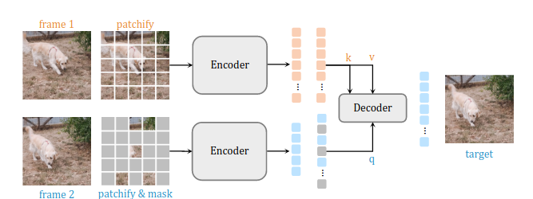

# Siamese Masked Autoencoders - Learning and Exploration

## Short Description

- **Course**: DD2412 Deep Learning Advanced at KTH
- **Project Team**: Friso de Kruiff, Magnus Tibbe, and Casper Augustsson Savinov
- **Focus**: Self-supervised learning and computer vision with [siamMAE](https://arxiv.org/abs/2305.14344). Replicating core results and potential research extensions.
- **Project Duration**: December 2023

## TODO
  -  Fix data loading to be more efficient using jax (PRIO)
  -  Fix data loading to work with real kinectis dataset (PRIO)
  -  Download validation dataset on VM
  -  Add evaluation 
  -  Add checkpointing
  -  Add load from checkpoint

## Relevant Research Papers

- **Original Paper**: [Siamese Masked Autoencoders](https://arxiv.org/abs/2305.14344) by Agrim Gupta, Jiajun Wu, Jia Deng, and Li Fei-Fei, 2023.
  - [arXiv](https://arxiv.org/abs/2305.14344)

- [Emerging Properties in Self-Supervised Vision Transformers](https://arxiv.org/abs/2104.14294) by Mathilde Caron, Hugo Touvron, Ishan Misra, Hervé Jégou, Julien Mairal, Piotr Bojanowski, Armand Joulin, 2021.
  - [arXiv](https://arxiv.org/abs/2104.14294)

- [Masked Autoencoders As Spatiotemporal Learners](https://arxiv.org/abs/2205.09113) by Christoph Feichtenhofer, Haoqi Fan, Yanghao Li, Kaiming He, 2022.
  - [arXiv](https://arxiv.org/abs/2205.09113)

- [An Image is Worth 16x16 Words: Transformers for Image Recognition at Scale](https://arxiv.org/abs/2010.11929) by Alexey Dosovitskiy, Lucas Beyer, Alexander Kolesnikov, Dirk Weissenborn, Xiaohua Zhai, Thomas Unterthiner, Mostafa Dehghani, Matthias Minderer, Georg Heigold, Sylvain Gelly, Jakob Uszkoreit, Neil Houlsby, 2021.
  - [arXiv](https://arxiv.org/abs/2010.11929)

- [A Simple Framework for Contrastive Learning of Visual Representations](https://arxiv.org/abs/2002.05709) by Ting Chen, Simon Kornblith, Mohammad Norouzi, Geoffrey Hinton, 2020.
  - [arXiv](https://arxiv.org/abs/2002.05709)

- [Masked Autoencoders Are Scalable Vision Learners](https://arxiv.org/abs/2111.06377) by Kaiming He, Xinlei Chen, Saining Xie, Yanghao Li, Piotr Dollár, Ross Girshick, 2021.
  - [arXiv](https://arxiv.org/abs/2111.06377)

## Possible Research Extensions

In addition to replicating the core results from the paper and gaining a deep understanding of Siamese Masked Autoencoders, our project has the potential for several research extensions. These extensions aim to explore the capabilities and applications of the model further. Here are some of the potential research directions we are considering:

1. **Exploring Additional Data Augmentations**: We aim to investigate whether the Siamese Masked Autoencoder method can be extended to work with different data augmentations, specifically rotation. Given the success of rotation in contrastive learning, we plan to experiment with various degrees of rotation to determine its impact on model performance.

2. **Complex Datasets**: To test the model's scalability and adaptability, we plan to evaluate Siamese Masked Autoencoders on more complex datasets, such as [VSPW](https://www.vspwdataset.com), [UVO](https://sites.google.com/view/unidentified-video-object/home), or [KITTI], which contain more objects per frame and pose unique challenges.

3. **Multi-Frame Prediction**: Building on the foundation of self-supervised learning, we want to explore the feasibility of predicting multiple future frames in video sequences. This extension would involve training the model to predict not just the immediate future frame but multiple frames ahead, potentially enhancing its temporal understanding.

4. **Uncertainty Estimation for Improved Performance**: We plan to leverage uncertainty estimation techniques to enhance the model's performance. This could involve generating uncertainty heatmaps of predicted pixel values, which may help in identifying areas where the model is more confident or uncertain. We can explore using this uncertainty estimate for "smart masking," prioritizing regions with high certainty or uncertainty to improve prediction quality or increase the difficulty of the task.

These research extensions are aligned with our core interests in self-supervised learning, generative models, and uncertainty estimation. While the primary focus is on replicating the core results of the paper, we believe these extensions have the potential to contribute to the broader understanding of Siamese Masked Autoencoders and their practical applications.

Please note that the feasibility and scope of these extensions may evolve as the project progresses, and we will adapt our plans accordingly.

## Reference

- **Original Paper**: [Siamese Masked Autoencoders](https://arxiv.org/abs/2305.14344) by Agrim Gupta, Jiajun Wu, Jia Deng, and Li Fei-Fei, 2023.

- [Emerging Properties in Self-Supervised Vision Transformers](https://arxiv.org/abs/2104.14294) by Mathilde Caron, Hugo Touvron, Ishan Misra, Hervé Jégou, Julien Mairal, Piotr Bojanowski, Armand Joulin, 2021.

- [Masked Autoencoders As Spatiotemporal Learners](https://arxiv.org/abs/2205.09113) by Christoph Feichtenhofer, Haoqi Fan, Yanghao Li, Kaiming He, 2022.

- [An Image is Worth 16x16 Words: Transformers for Image Recognition at Scale](https://arxiv.org/abs/2010.11929) by Alexey Dosovitskiy, Lucas Beyer, Alexander Kolesnikov, Dirk Weissenborn, Xiaohua Zhai, Thomas Unterthiner, Mostafa Dehghani, Matthias Minderer, Georg Heigold, Sylvain Gelly, Jakob Uszkoreit, Neil Houlsby, 2021.

- [A Simple Framework for Contrastive Learning of Visual Representations](https://arxiv.org/abs/2002.05709) by Ting Chen, Simon Kornblith, Mohammad Norouzi, Geoffrey Hinton, 2020.

- [Masked Autoencoders Are Scalable Vision Learners](https://arxiv.org/abs/2111.06377) by Kaiming He, Xinlei Chen, Saining Xie, Yanghao Li, Piotr Dollár, Ross Girshick, 2021.

## Resources, Links, and YouTube Videos

- **EXREMLY GOOD JAX TOTURIALS** [Tutorial JAX](https://uvadlc-notebooks.readthedocs.io/en/latest/index.html)

- [JAX+FLAX+Optax Short Presentation](https://phlippe.github.io/media/GDE_Talk_Intro_to_JAX_Flax_2022_12_06.pdf)

- [Transformers from Scratch]([https://www.youtube.com/watch?v=U0s0f995w14) 
  
- [How to do deep learning (transformers)](https://www.youtube.com/watch?v=bvBK-coXf9I) 

- [Illustrated Transformer](https://jalammar.github.io/illustrated-transformer/)

- [Illustrated Self-Attention](https://towardsdatascience.com/illustrated-self-attention-2d627e33b20a)

- [Searching for Activation Functions](https://arxiv.org/abs/1710.05941)

- [Pre-layer initialization Transformers](http://proceedings.mlr.press/v119/xiong20b/xiong20b.pdf)
